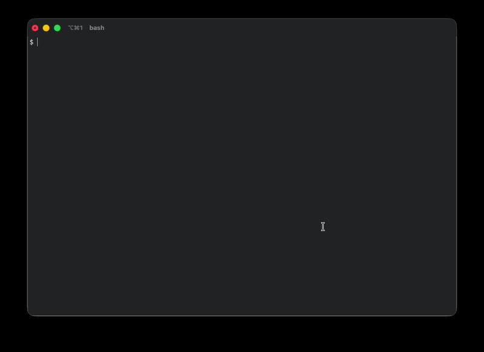
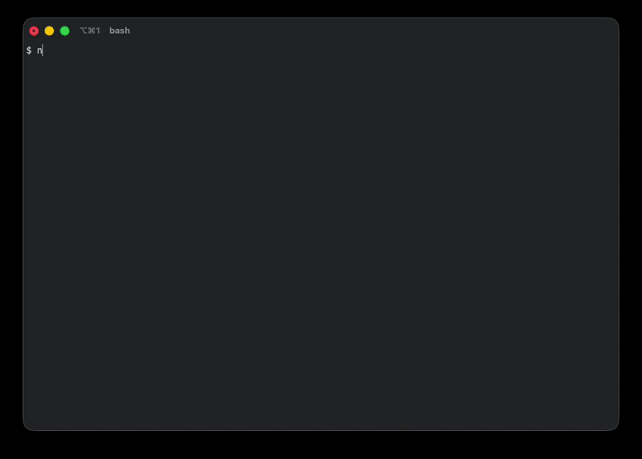

# NetBox CLI

## What It Is

`netbox-cli` is a read-only Python CLI for NetBox.

The package is published on PyPI as `netbox-explorer`, while the installed command remains `netbox`.

It provides two aligned interfaces:

- a standard command line for automation, documentation, and copy/paste use
- an interactive shell for faster exploration, using the same service layer and command semantics

The CLI is the primary interface. 



The shell is a convenience layer on top of it.




## Features

- explicit configuration with `netbox init`
- config validation and connectivity checks with `netbox config test`
- discovery of apps, endpoints, filters, and known choices from the NetBox API
- read-only `list`, `get`, and grouped global `search`
- Rich tables for interactive terminal output
- JSON and CSV output for automation and piping
- interactive shell with history, contextual navigation, and autocomplete
- local metadata caching for API root, schema, and endpoint `OPTIONS`

## Install

Using a virtual environment is the recommended install path.

### Install from PyPI

Use this for the normal published package install.

```bash
python3 -m venv .venv
source .venv/bin/activate
python3 -m pip install --upgrade pip
python3 -m pip install netbox-explorer
```

### Install from GitHub

Use this when you want to try the tool quickly without cloning the repository.

```bash
python3 -m venv .venv
source .venv/bin/activate
python3 -m pip install --upgrade pip
python3 -m pip install "git+https://github.com/fciarfella/netbox-cli.git"
```

### Install a tagged release from GitHub

Use a tagged release when you want a specific published version from GitHub.

```bash
python3 -m pip install "git+https://github.com/fciarfella/netbox-cli.git@v0.1.0"
```

### Install from a local clone

Use a local clone when you want to develop the project or make local changes.

```bash
git clone https://github.com/fciarfella/netbox-cli.git
cd netbox-cli
python3 -m venv .venv
source .venv/bin/activate
python3 -m pip install --upgrade pip
python3 -m pip install -e .
```

### Install development dependencies

```bash
python3 -m pip install -e ".[dev]"
```

### Verify the install

```bash
netbox --help
netbox --version
```

### Reactivate the environment

If you open a new shell later, reactivate the environment first:

```bash
source .venv/bin/activate
```

## Configuration

`config.toml` is the primary configuration source for the tool. Environment variables are supported as optional overrides, but normal usage should start with an explicit config file.

Examples in this README assume you have access to a reachable NetBox instance and a valid API token. DNS plugin examples apply only when that plugin is installed and exposed by your NetBox API.

Create config:

```bash
netbox init
```

Example:

```bash
netbox init \
  --url https://netbox.example.com \
  --token YOUR_TOKEN \
  --default-format table \
  --default-limit 25
```

Validate config, token, and connectivity:

```bash
netbox config test
```

Show config, cache, and history paths:

```bash
netbox config paths
```

Clear cached metadata:

```bash
netbox cache clear
```

Typical paths:

```text
~/.config/netbox-cli/config.toml
~/.cache/netbox-cli/
~/.local/state/netbox-cli/shell-history
```

Optional environment variable overrides:

```text
NETBOX_URL
NETBOX_TOKEN
NETBOX_CLI_DEFAULT_FORMAT
NETBOX_CLI_DEFAULT_LIMIT
NETBOX_CLI_TIMEOUT
NETBOX_CLI_VERIFY_TLS
NETBOX_CLI_CONFIG
NETBOX_CLI_CONFIG_DIR
NETBOX_CLI_CACHE_DIR
NETBOX_CLI_HISTORY_DIR
NETBOX_CLI_HISTORY_PATH
```

## CLI Quick Start

Common first commands:

```bash
netbox config test
netbox list
netbox list dcim
netbox filters dcim/devices
netbox list dcim/devices status=active
netbox list dcim/devices q=router01 --cols name,site,status
netbox get dcim/devices id=1490
netbox search router01 --cols id,name,site,status
```

## CLI Examples

Discover apps and endpoints:

```bash
netbox list
netbox list dcim
```

Compatibility commands remain available:

```bash
netbox apps
netbox endpoints dcim
```

Inspect endpoint filters and known choices:

```bash
netbox filters dcim/devices
```

List rows from an endpoint:

```bash
netbox list
netbox list dcim
netbox list dcim/devices status=active
netbox list dcim/devices router01
netbox list dcim/devices router 01
netbox list dcim/devices router01 status=active
netbox list dcim/devices site=dc1 site=lab
netbox list dcim/devices status=active status=offline
netbox list dcim/devices q=router01
netbox list dcim/devices name__ic=router
netbox list dcim/devices q=router01 --cols name,site,status
netbox list plugins/netbox-dns/records q=198.51.100.10 --cols zone,name,type,value,status
```

The CLI `list` command follows the same exploration flow and shorthand as the shell:

```bash
netbox list
netbox list dcim
netbox list dcim/devices
```

Inside an endpoint path, bare terms are treated as `q=...`:

```bash
netbox list dcim/devices router01
```

This behaves like:

```bash
netbox list dcim/devices q=router01
```

Fetch exactly one object:

```bash
netbox get dcim/devices id=1490
```

Run global search across curated endpoints:

```bash
netbox search router01
netbox search router01 --cols id,name,site,status
```

`--cols` takes a comma-separated list of fields and overrides the default profile columns for `list` and `search`.

Use `netbox search <term>` when you want a broad search across multiple object types.

Use `netbox list` to explore progressively:

- `netbox list` shows top-level apps
- `netbox list <app>` shows endpoints for that app
- `netbox list <app>/<endpoint>` lists records from that endpoint

Use `netbox list <endpoint> q=<term>` when you already know the endpoint you want to search inside.

Examples:

```bash
netbox search router01
netbox list dcim/devices q=router01
```

Actual supported filters depend on the target endpoint and the schema exposed by your NetBox instance. For endpoint-specific lookups, `netbox filters <app>/<endpoint>` shows what the tool has discovered.

For multi-value filters, repeat the parameter instead of using a comma-separated value:

```bash
netbox list dcim/devices site=dc1 site=lab
```

This is separate from NetBox options like `ordering`, where comma-separated values are still the normal form:

```bash
netbox list dcim/devices ordering=name,-serial
```

## Search Behavior

`netbox search <term>` searches a curated set of endpoints and groups results by object type.

The v1 search set includes:

- `dcim/devices`
- `virtualization/virtual-machines`
- `ipam/ip-addresses`
- `ipam/prefixes`
- `ipam/vlans`
- `dcim/sites`
- `dcim/racks`
- `plugins/netbox_dns/records` when available

Ranking prefers:

1. exact matches
2. prefix matches
3. substring matches

Search output is grouped by endpoint and shows the endpoint path, match count, and a useful default column set for each group.

## Interactive Shell

Launch the shell:

```bash
netbox shell
```

The prompt always shows the current path, output format, and row limit:

```text
netbox:/ [table|15]>
```

Typical session:

```text
netbox:/ [table|15]> list
netbox:/ [table|15]> cd dcim
netbox:/dcim [table|15]> list
netbox:/dcim [table|15]> cd devices
netbox:/dcim/devices [table|15]> filters
netbox:/dcim/devices [table|15]> list status=active
netbox:/dcim/devices [table|15]> open 1
```

Change output format and row limit:

```text
netbox:/dcim/devices [table|15]> format json
netbox:/dcim/devices [json|15]> limit 5
netbox:/dcim/devices [json|5]> get name=router01
```

Search and open:

```text
netbox:/ [table|15]> search router01
netbox:/ [table|15]> open 2
```

Inside an endpoint context, `list` supports a shorthand search term:

```text
netbox:/dcim/devices [table|15]> list web01
```

This behaves like:

```text
netbox:/dcim/devices [table|15]> list q=web01
```

Quoted values work the same way:

```text
netbox:/dcim/devices [table|15]> list "router 01"
```

This behaves like:

```text
netbox:/dcim/devices [table|15]> list q="router 01"
```

Mixed shorthand and explicit filters also work:

```text
netbox:/dcim/devices [table|15]> list web01 status=active
```

This behaves like:

```text
netbox:/dcim/devices [table|15]> list q=web01 status=active
```

If `q=...` is already present explicitly, the shell does not add a second `q`.

Repeated filters are supported in the shell the same way they are in the CLI:

```text
netbox:/dcim/devices [table|15]> list site=dc1 site=lab
netbox:/dcim/devices [table|15]> list web01 site=dc1 site=lab
```

Shell commands:

Navigation:

```text
cd [path]
```

Inspection:

```text
filters
list [term] [k=v ...]
get [k=v ...]
search <term>
open <index>
```

Session controls:

```text
cols
cols a,b,c
cols reset
format <table|json|csv>
limit <n>
exit
help
```

## Autocomplete

Shell completion is contextual.

It uses the current shell state plus cached metadata to suggest:

- shell commands
- app names
- endpoint path segments
- filter names for the current endpoint
- known choice values for filters
- known and default columns
- simple enum values such as output formats

Examples:

```text
cd d<TAB>                  -> dcim
cd /plugins/ne<TAB>        -> /plugins/netbox_dns
cd net<TAB>                -> netbox_dns
list st<TAB>               -> status=
list status=<TAB>          -> active offline planned
cols na<TAB>               -> name
format j<TAB>              -> json
```

Completion is driven by shell state and cached metadata. If metadata for the current context is missing, the shell may fetch it lazily once and then reuse it for later completions.

## Output Formats

CLI and shell share the same renderers.

Available formats:

- `table`
- `json`
- `csv`

Use table output for interactive work:

```bash
netbox list dcim/devices status=active
```

Use JSON when you want machine-readable output:

```bash
netbox get dcim/devices id=1490 --format json
netbox list dcim/devices q=router01 --cols name,site,status --format json
```

Use CSV when you want simple pipe-friendly rows:

```bash
netbox list dcim/devices status=active --format csv
netbox search router01 --cols id,name,site,status --format csv
```

In the shell, numbered results are mainly meant for table-mode exploration with `open <index>`. JSON and CSV still include the index for consistency, but the primary workflow is interactive table output plus `open`.

## Cache

The tool caches a small amount of discovery metadata locally:

- API root
- schema
- endpoint `OPTIONS` metadata

This cache improves discovery, filter help, choice lookups, and autocomplete responsiveness.

Use this command to clear it:

```bash
netbox cache clear
```

`netbox cache clear` is the supported reset path. There is no `--no-cache` flag.

## Project Layout

The codebase is split by responsibility:

```text
netbox_cli/
  app.py
  client.py
  config.py
  discovery.py
  query.py
  search.py
  render.py
  cache.py
  profiles.py
  repl/
    shell.py
    state.py
    commands.py
    completer.py
    metadata.py
tests/
  ...
```

## Known Limitations

- v1 is read-only
- the shell is line-oriented, not a full-screen TUI
- autocomplete is best-effort when metadata is incomplete or unavailable
- plugin endpoints are handled gracefully, but depend on what your NetBox instance exposes
- endpoint-specific filter support depends on the schema and metadata provided by your NetBox instance
